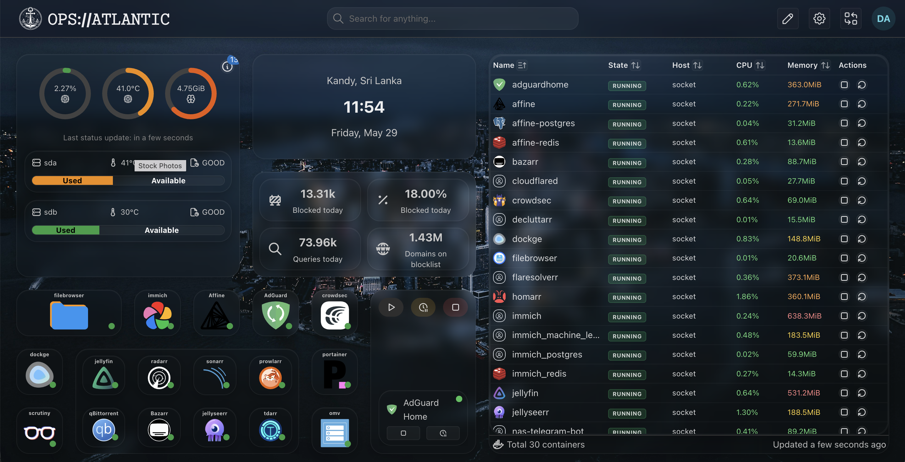

# 𝙾𝙿𝚂://𝙰𝚃𝙻𝙰𝙽𝚃𝙸𝙲

A naval-inspired glassmorphism theme for Homarr.

𝙾𝙿𝚂://𝙰𝚃𝙻𝙰𝙽𝚃𝙸𝙲 transforms Homarr into a modern operations center with frosted glass widgets, tactical styling, optimized modals, and a clean maritime aesthetic.



---

## Features

- Naval / Tactical visual design
- Frosted glassmorphism interface
- GPU-optimized rendering
- Smooth Mantine modals and popups
- Styled Docker tables
- Responsive layouts
- Glass progress bars
- Custom Atlantic wallpaper
- Custom 𝙾𝙿𝚂://𝙰𝚃𝙻𝙰𝙽𝚃𝙸𝙲 branding

---

## Installation

### 1. Download Theme

Clone this repository:

```bash
git clone https://github.com/<your-username>/homarr-ops-atlantic.git
```

### 2. Apply CSS

Open:

Settings → Board → Custom CSS

Copy the contents of:

```text
theme/ops-atlantic.css
```

Paste and save.

### 3. Upload Assets

Upload:

```text
assets/wallpaper.jpg
assets/logo.png
```

through Homarr Board Settings.

### 4. Configure

Recommended board title:

```text
𝙾𝙿𝚂://𝙰𝚃𝙻𝙰𝙽𝚃𝙸𝙲
```

---

## Included Assets

| Asset | Purpose |
|---------|---------|
| wallpaper.jpg | Background image |
| logo.png | Dashboard logo |
| ops-atlantic.css | Theme stylesheet |

---

## Design Goals

𝙾𝙿𝚂://𝙰𝚃𝙻𝙰𝙽𝚃𝙸𝙲 was designed to feel like:

- A ship command center
- A naval operations room
- A modern bridge console
- A tactical monitoring dashboard

The theme prioritizes readability, subtle effects, and performance over excessive animations.

---

## Tested With

- Homarr v1+
- Docker widgets
- OpenMediaVault widgets
- Health Monitoring widgets
- Mantine UI components
- Desktop layouts
- Mobile layouts

---

## Screenshots

Contributions of additional screenshots are welcome.

---

## License

MIT License

Feel free to modify, share, and build upon this theme.


---

## Credits

Created by Danuja.

Inspired by naval operations centers, maritime navigation systems, and modern glassmorphism design.